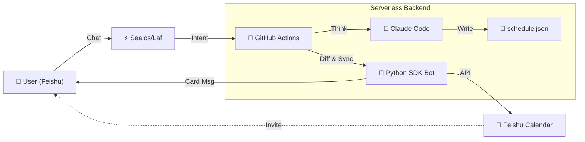

# 🤖 LifeOps: Serverless AI Schedule Agent

**" 专为连时间都懒得自己安排的懒狗设计."**

[核心特性] • [架构设计] • [部署指南] • [使用手册]

-----

## 📖 简介 (Introduction)

**LifeOps** 是一个基于 **GitOps** 理念的无头（Headless）个人日程管理系统。

在这个系统中，**Git 仓库是唯一的真理来源 (Single Source of Truth)**。所有的日程数据都以 JSON 格式存储在私有仓库中。你不需要打开复杂的日历应用，只需要在 **飞书 (Feishu/Lark)** 中与 AI 机器人对话，它就会利用 **GitHub Actions** 的边缘计算能力，驱动 **Claude Code + GLM4.6** 进行智能决策、冲突检测和日程排期，并最终通过飞书官方 SDK **无感同步** 到你的日历。

### ✨ 核心特性

- **🗣️ 自然语言交互**：直接对机器人说 *"明早 9 点有深度工作，别让人打扰"*，自动识别时间与意图。
- **🧠 智能冲突仲裁**：个性化 Claude Code 指令，自动保护 **P0 (生存)** 和 **P1 (深度工作)** 任务，拒绝低优先级打扰。
- **⚡️ 智能增量同步 (Smart Diff)**：
    - 采用 **"Diff & Patch"** 策略，仅在 Git 数据变更时触发同步。
    - **防轰炸机制**：自动识别已存在的日程，绝不重复发送邀请。
    - **双向绑定**：机器人创建日程 -> 自动将你加入参与人 -> 你的日历实时更新。
- **🎨 精美卡片反馈**：查询时返回飞书富文本卡片，清晰展示时间轴与优先级。
- **☁️ 零运维成本**：完全基于 Serverless (GitHub Actions + Sealos/Laf)，无服务器维护烦恼。
- **🔒 数据完全私有**：所有日程数据存储在私有 GitHub 仓库的 JSON 文件中，历史版本可回溯。

-----

## 🏗️ 系统架构 (Architecture)

-----

## 🚀 部署指南 (Deployment)

### 前置准备

1.  **GitHub 账号**：用于托管代码和运行 Action。
2.  **飞书企业自建应用**：用于机器人交互和日历操作。
3.  **Sealos (或 Laf) 账号**：用于搭建轻量级 Webhook 网关。
4.  **Claude (或 Zhipu)** API Key：用于驱动 AI 大脑。

### 第一步：创建仓库

1.  Fork 本仓库或使用 Template 创建新仓库。
2.  ⚠️ **重要**：务必将仓库设为 **Private (私有)**，以保护您的日程隐私。

### 第二步：配置飞书应用

1.  前往 [飞书开放平台](https://open.feishu.cn/) 创建企业自建应用。
2.  **添加能力**：开启“机器人”。
3.  **权限管理**：开通以下权限并**发布版本**：
    - `im:messages` (接收消息)
    - `im:messages:read` (读取消息)
    - `calendar:calendar` (获取日历信息)
    - `calendar:calendar.event` (日程增删改)
4.  记录 `App ID` 和 `App Secret`。

### 第三步：部署 Sealos 网关

1.  登录 Sealos/Laf，新建云函数 `feishu-bridge`。
2.  复制 `gateway/feishu-bridge.js` 的代码到云函数。
3.  配置云函数环境变量：
    - `FEISHU_APP_ID`: 你的飞书 App ID
    - `FEISHU_APP_SECRET`: 你的飞书 App Secret
    - `FEISHU_ENCRYPT_KEY`: (可选) 飞书事件订阅的加密 Key
    - `GITHUB_TOKEN`: GitHub Personal Access Token (权限需包含 `repo`)
    - `GITHUB_REPO`: `你的用户名/仓库名`
4.  发布函数，获取 URL。
5.  回到飞书开放平台 -> **事件订阅**，填入该 URL，并订阅 `接收消息 v2.0` 事件。

### 第四步：配置 GitHub Secrets

在 GitHub 仓库 -> Settings -> Secrets and variables -> Actions 中添加：

| Secret Name | 说明 |
| :--- | :--- |
| `ZHIPU_API_KEY` | LLM 密钥 (推荐智谱，兼容 Claude 协议) |
| `FEISHU_APP_ID` | 飞书应用 ID |
| `FEISHU_APP_SECRET` | 飞书应用 Secret |
| `FEISHU_USER_ID` | 您的飞书 **Open ID** (用于机器人拉你进日程) |
| `FEISHU_CALENDAR_ID`| (可选) 指定日历 ID，不填则默认为机器人的 `primary` 日历 |

> **如何获取 `FEISHU_USER_ID`?**
> 部署好 Sealos 后，在飞书给机器人随便发一条消息，查看 Sealos 函数日志，日志中会打印 `Sender ID`，即为您的 Open ID (通常以 `ou_` 开头)。

-----

## 🗣️ 使用手册 (Usage)

### 1. 查询日程

直接询问机器人，Sealos 网关会拦截查询请求（不消耗 GitHub Action 资源），快速返回。

> "看看今天的安排"
> "下周有什么日程？"

### 2. 管理日程

发送包含修改意图的指令，触发 Claude 思考与 Git 写入。

> "明天上午 10 点加个会，讨论架构设计"
> "把周五下午的 P3 任务都删掉"
> "初始化下周日程：周一早8点开会，周二晚6点健身"

### 3. 手动同步 (Diff Sync)

如果发现飞书日历与 Git 不一致，可以强制触发同步。

> "同步日程"

-----

## ⚙️ 进阶配置

### 调整 AI 指令 (`config/instructions.xml`)

这是 AI 的行为准则。您可以在此文件中定义：

- **优先级矩阵**：定义什么是 P0 (不可移动)、P1 (深度工作)。
- **作息偏好**：例如 *"Morning Block: 09:00-11:00 禁止安排会议"*。

### 调整同步策略 (`scripts/feishu_bot.py`)

- `HISTORY_DAYS`: 自动清理多久以前的历史数据 (默认 30 天)。
- `SYNC_FUTURE_DAYS`: 同步未来多少天的日程 (默认 90 天)。

-----

## 🛠 技术栈与依赖

* **Runtime**: Python 3.10+
* **Dependencies**:
    * `lark-oapi`: 飞书官方 SDK，用于稳健的日历操作。
    * `requests`:用于轻量级 API 调用。
* **CI/CD**: GitHub Actions (Ubuntu Latest)

-----

## 📄 License

Distributed under the MIT License. See `LICENSE` for more information.

-----

*Created with ❤️ by Jingyi*
